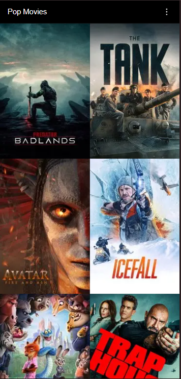
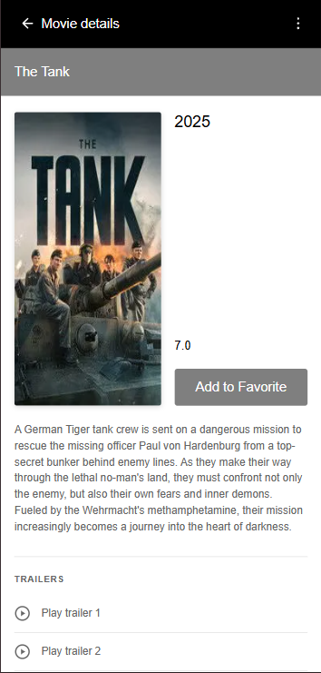

# Movie Discovery App

A mobile-focused movie discovery application built as part of a technical take-home assignment.  
The app allows users to discover popular movies and view detailed information for each title.

## Technology Stack
- Next.js
- JavaScript/Typescript
- Fetch API for data retrieval
- CSS Modules (no UI libraries)
- The Movie Database (TMDB) API
- Jest and React Testing Library for testing
- pnpm for package management

## Core Functionality
- Grid-based discovery screen displaying popular movies
- Movie details screen with:
    - Original title
    - Poster image
    - Overview
    - User rating
    - Release date
- Responsive, mobile-first layout

## Screenshots

### Movie Discovery Screen

### Movie Details Screen

## API Configuration (IMPORTANT)

This project consumes the TMDB API.  
**The API key has been intentionally removed and is not included in the repository.**

### Adding Your Own API Key

1. Create an account at https://www.themoviedb.org
2. Request an API key for educational / non-commercial use
3. Create a `.env.local` file in the project root. See `env.example` for reference.:

TMDB_API_KEY=your_api_key_here

The API key is accessed in the application using:

process.env.TMDB_API_KEY

The `.env.local` file is excluded from version control.

## Image Handling

Movie poster URLs are constructed using the TMDB-recommended format:

https://image.tmdb.org/t/p/w185/{poster_path}

## Local Development

pnpm install
pnpm run dev

Then open:

http://localhost:3000

## Additional Notes

- API key is excluded by design
- Optimized for mobile devices (iOS and Android)
